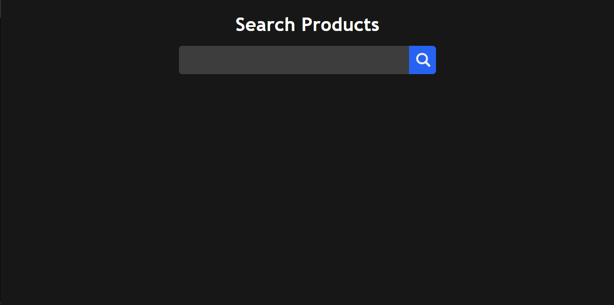

<a name="readme-top"></a>
<!-- PROJECT LOGO -->
<div margin-top="40px" align="center">
  <h1 align="center">Amazon Scraper</h1>
</div>

<!-- TABLE OF CONTENTS -->
<details>
  <summary>Table of Contents</summary>
  <ol>
    <li>
      <a href="#about-the-project">About The Project</a>
      <ul>
        <li><a href="#built-with">Built With</a></li>
      </ul>
    </li>
    <li>
      <a href="#getting-started">Getting Started</a>
      <ul>
        <li><a href="#prerequisites">Prerequisites</a></li>
        <li><a href="#installation">Installation</a></li>
      </ul>
    </li>
    <li><a href="#usage">Usage</a></li>
    <li><a href="#roadmap">Roadmap</a></li>
    <li><a href="#contributing">Contributing</a></li>
    <li><a href="#license">License</a></li>
    <li><a href="#contact">Contact</a></li>
    <li><a href="#acknowledgments">Acknowledgments</a></li>
  </ol>
</details>


<!-- ABOUT THE PROJECT -->
## About The Project



This is a web scraper aplication with both frontend and backend, the frontend does a AJAX request for the backend with whatever you typed, than the backend makes e axios request to the amazon endpoint with that specific keyword from the front, than with JSDOM goes through the products available on the first page, get the information needed, which in this case are the image URL, title, rating and review count, even tho it's pretty easy to get other information as well, and with that information the frontend displays the products on screen.

<p align="right">(<a href="#readme-top">back to top</a>)</p>

### Built With

This section should list any major frameworks/libraries used to bootstrap your project. Leave any add-ons/plugins for the acknowledgements section. Here are a few examples.
<p align="center">
  <br>
</p>

<p align="right">(<a href="#readme-top">back to top</a>)</p>


<!-- GETTING STARTED -->
## Getting Started

This is how you can setup and use this project locally.
To get a local copy up and running follow these simple example steps.

### Prerequisites

This is what you'll need to run this application and how to install them if you are on linux.
* node
  ```sh
  sudo apt install nodejs
  ```

* npm
  ```sh
  sudo apt install npm
  ```

If you are on mac or windows I recommend you checking the official node website and download the installation media for each of the options.

  ```sh
  https://nodejs.org/en/download/current
  ```


### Installation

_Below is discribes how to install and setup your app._

1. Clone the repo
   ```sh
   git clone https://github.com/othonoliveira/Amazon-Scrapper.git
   ```
   or 
   ```sh
   git clone git@github.com:othonoliveira/Amazon-Scrapper.git
   ```

2. Enter the project folder
   ```sh
   cd Amazon-Scrapper/
   ```

3. Install NPM packages
   ```sh
   npm install
   ```
4. Set up a .env file for the server (optional)
   ```js
   const API_PORT = 'ENTER PORT NUMBER';
   ```

<p align="right">(<a href="#readme-top">back to top</a>)</p>


<!-- USAGE EXAMPLES -->
## Usage

1. Start the server by running this code on the main directory
   ```sh
   npm start
   ```

2. Go to the frontend folder and open the app.html file
<br>
3. Than you can already use the page freely

<p align="right">(<a href="#readme-top">back to top</a>)</p>

